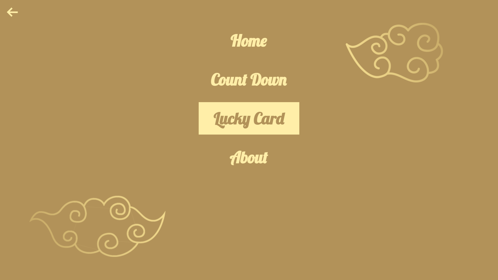
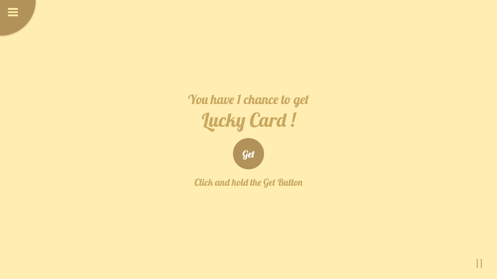
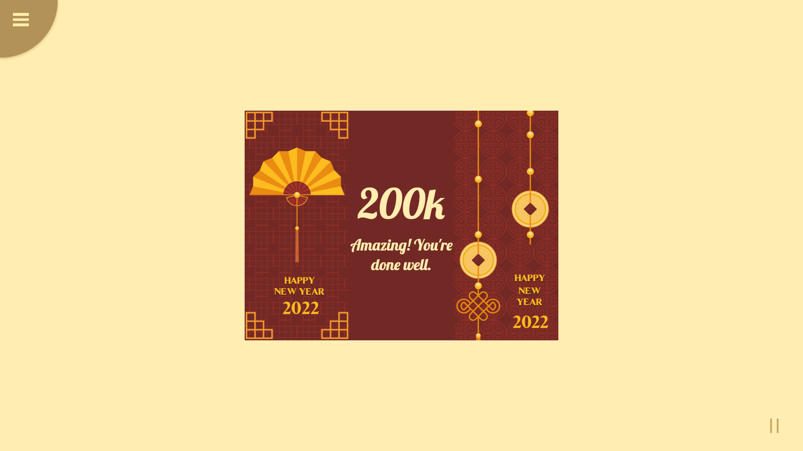

<h1 align="center">Countdown-NewYear</h1>

<strong>Tet Holiday on the net!</strong>

  
  

  
  
  
  

<a href="https://yuran1811.github.io/Countdown-NewYear/" target="_blank">Live Demo</a>

## Screenshots

